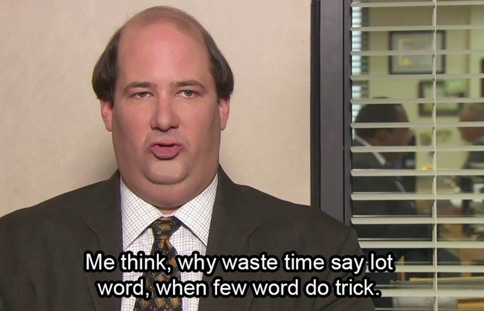
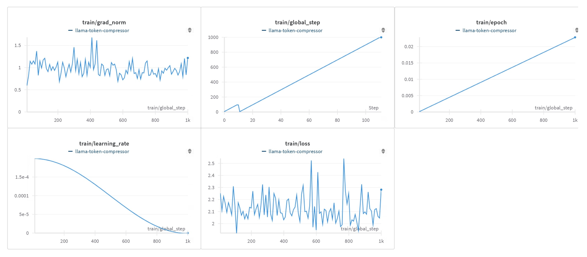
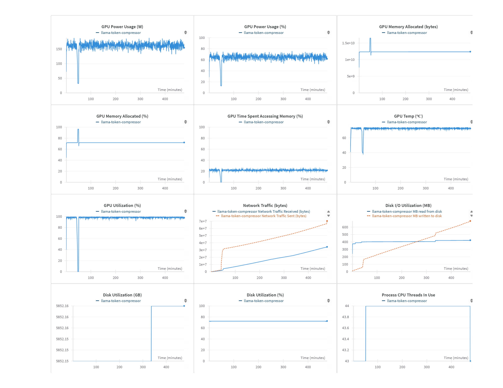

# Kevin - A Token Compressor for Long-Range Dependency Conversations



## Model Details

### Model Description

This model is a fine-tuned version of the Llama 3.1 8B 4-bit model, specifically trained for token compression tasks. It uses LoRA (Low-Rank Adaptation) for efficient fine-tuning while maintaining the base model's performance.

- **Developed by:** Alosh Denny
- **Funded by:** TinkerSpace
- **Shared by** EmelinLabs
- **Model type:** Token Compressor for Memories
- **Language(s) (NLP):** English
- **License:** apache-2.0

## Uses

### Direct Use

This model is designed for token compression tasks. It can be used to generate more concise versions of input text while preserving the essential meaning.

### Downstream Use

The compressed outputs from this model can be used in various NLP applications where text length is a constraint, such as summarization, efficient text storage, or as input for other language models with token limits.

### Out-of-Scope Use

This model should not be used for tasks that require full preservation of the original text or where nuanced details are critical. It's not suitable for legal, medical, or other domains where precise wording is essential.

## Bias, Risks, and Limitations

- The model may inadvertently remove important context or nuance during compression.
- There might be biases inherited from the base Llama 3.1 model or introduced during fine-tuning.
- The model's performance may vary depending on the input text's domain or complexity.

### Recommendations

- Users should review the compressed outputs for accuracy and appropriateness before use in critical applications.
- It's advisable to test the model on a diverse range of inputs to understand its performance across different text types and domains.

## How to Get Started with the Model

Use the code below to get started with the model.

```python
from peft import PeftModel, PeftConfig
from transformers import AutoModelForCausalLM

config = PeftConfig.from_pretrained("aoxo/kevin-token-compressor")
base_model = AutoModelForCausalLM.from_pretrained("unsloth/Meta-Llama-3.1-8B-bnb-4bit")
model = PeftModel.from_pretrained(base_model, "aoxo/kevin-token-compressor")
```

## Training Details

### Training Data

The model was trained on a dataset compiled from various sources, including:
- Respair/sharegpt_chatml_compressed
- diwank/llmlingua-compressed-text
- AlexMaclean/wikipedia-deletion-compressions
- AlexMaclean/all-deletion-compressions
- sentence-transformers/sentence-compression

### Training Procedure


#### Preprocessing

Prompt-response pairs were processed from the datasets and compiled into a single dataset (available at https://huggingface.co/datasets/aoxo/token_compressor). Unwanted characters, trailing whitespaces and inverted commas were voided.

#### Training Hyperparameters

- **Training regime:** bf16 mixed precision
- **Optimizer:** paged_adamw_8bit
- **Learning rate:** 2e-4
- **LR scheduler:** cosine
- **Batch size:** 4 per device
- **Gradient accumulation steps:** 16
- **Number of epochs:** 10
- **Max steps:** 175,118

#### LoRA Configuration

- **r:** 8
- **lora_alpha:** 16
- **lora_dropout:** 0.05
- **bias:** none
- **task_type:** CAUSAL_LM

#### Speeds, Sizes, Times

- **Total Training Compute Throughput:** 8.62 PFLOPS
- **Total Logged Training Time:** 1422.31 hours
- **Start Time:** 07-21-2024 02:02:32
- **End Time:** 09-18-2024 08:21:08
- **Checkpoint Size (Adapter):** 13,648,432 bytes





### Evaluation Data, Factors & Results

## Evaluation

- **Total Evaluation Compute Throughput:** 14.34 GFLOPS
- **Total Logged Evaluation Time:** 34.25 minutes
- **Start Time:** 09-18-2024 08:23:11
- **End Time:** 09-18-2024 08:57:26

#### Evaluation Data

Evaluation was performed on a subset of the following dataset:

- sentence-transformers/sentence-compression

### Results

To demonstrate the model's performance, we've tested it on prompts of varying lengths. The results show how the model compresses texts of different sizes while maintaining the core meaning.

#### Evaluation 1: Movie Scene


**Input:**
```
A blood black nothingness began to spin. Began to spin. Let's move on to system. System. Feel that in your body? The system. What does it feel like to be part of the system? System. Is there anything in your body that wants to resist the system? System. Do you get pleasure out of being a part of the system? System. Have they created you to be a part of the system? System. Is there security in being a part of the system? System. Is there a sound that comes with the system? System. We're going to go on. Cells. They were all put together one at a time. Cells. Millions and billions of them. Cells. Were you ever arrested? Cells. Did you spend much time in the cell? Cells. Have you ever been in an instituion? Cells. Do they keep you in a cell? Cells. When you're not performing your duties do they keep you in a little box? Cells. Interlinked. What's it like to hold the hand of someone you love? Interlinked. Do they teach you how to feel finger to finger? Interlinked. Do you long for having your heart interlinked? Interlinked. Do you dream about being interlinked? Iterlinked. Have they left a place for you where you can dream? Interlinked. What's it like to hold your child in your arms? Interlinked. What's it like to play with your dog? Interlinked. Do you feel that there's a part of you that's missing? Interlinked. Do you like to connect to things? Interlinked. What happens when that linkage is broken? Interlinked. Have they let you feel heartbreak? Interlinked. Did you buy a present for the person you love? Within cells interlinked. Why don't you say that three times? Within cells interlinked. Within cells interlinked. Within cells interlinked. Where do you go when you go within? Within. Has anyone ever locked you out of a room within? Within. Where do you go to when you go within? Within. Where is the place in the world you feel the safest? Within. Do you have a heart? Within. Stem. Did you pick asparagus stems? Stem. What comes from something else? Stem. Have you been to the source of a river? Stem. When's the first time you gave a flower to a girl? Stem. What did she look like? Stem. Is it a slang word for person's legs? Stem. Have you planted things in the ground? Stem. Have you ever been in a legal battle? Stem. Within one stem. Dreadfully. Is that an old fashioned word? Dreadfully. Did you ever want to live in the nineteenth century? Dreadfully. What's it like to be filled with dread? Dreadfully. Do you think you could find out all the answers to all the questions? Dreadfully. Distinct. How good are your eyes? Distinct. Do you have a particular personality? Distinct. What separates somebody from somebody else? Distinct. Who do you admire most in the world? Distinct. What was your most shameful moment? Distinct. Dreadfully distinct. Dark. Were you afraid of the dark whan you were little? Dark. What's it like to hide under a bed? Dark. Did they keep you in a drawer when they were building you? Dark. Was it dark in there? Dark. Do you have dark thoughts? Dark. Did they program you to have dark thoughts? Dark. Do you think it's some kind of corruption these dark thoughts? Dark. Maybe it's a spot of rust or something? Dark. Who's the darkest person you know? Dark. What is it like when someone gives you the silent treatment. Dark. Who did you get your darkness from? Dark. Against the dark. What kind of power do you have against the dark. Against the dark. Do you think there is such a thing as evil? Against the dark. Do you think you can protect people against the dark. Against the dark. Why are these things happening? Against the dark. Do you prefer the day or the night? Against the dark. When is the last time you saw a starry sky? Against the dark. What's your favorite part of the moon? Against the dark. Fountain. Have you seen the Trevi fountain in Rome? Fountain. Have you ever seen the fountain in Lincoln center? Fountain. Have you seen fountains out in the wild? Fountain. What's it like when you have an orgasm. Fountain. Have you read the Fountainhead? Fountain. White Fountain. Is it pure white? White Fountain. Is that a metaphor? White Fountain. How did the white Fountain make you feel? White Fountain. A tall white fountain played. When you were little did you ever fall into a Fountain? A Tall White Fountain. Do you like fire, earth, air or water. A Tall White Fountain. Do you like skipping around in the water? A Tall White Fountain. A blood black nothingness. A system of cells. Within cells interlinked. Within one stem. And dreadfully distinct. Against the dark. A tall white fountain played.
```

**Output:**
```
A blood black nothingness spins. The system—feel it? What’s it like to be part of it? Any resistance? Pleasure? Security? Cells, billions of them. Have you ever been kept in a cell? Interlinked—finger to finger, heart to heart, dream to dream. Within cells interlinked. Stem—where does it come from? Dreadfully distinct, filled with dread. Dark—were you programmed with dark thoughts? Against the dark—can you protect others from it? A tall white fountain—pure, flowing. Blood black nothingness, systems, cells, and fountains—all interlinked, against the dark.
```

#### Evaluation 2: News Article

**Input:**
```
ORLANDO, Fla. - A man who allegedly stole a swan boat and marooned himself on a fountain in the middle of a Florida lake told police he took a large quantity of MDMA and wanted to be with the swans that frequent the lake. According to an Orlando police report obtained by Orlando Weekly, 36-year-old Kyle Thurston said he wanted to be with the swans because "they don't judge him." At about 4 a.m. Friday, Orlando police came to Lake Eola and found Thurston sitting on the fountain screaming for help. Police said Thurston forgot to tie up the swan boat and it drifted off while he was on the fountain. When he returned to where he thought the boat would be and realized it was gone, he sat down on the fountain and started calling for help, police said. Orlando police are following up with the rental boat company to see if any charges will be filed.
```

**Output:**
```
In Orlando, a man on MDMA stole a swan boat and got stranded on a lake fountain, saying he wanted to be with the "non-judgmental" swans. Police found him screaming for help after the boat drifted away. Charges are under review.
```

#### Evaluation 3: Song Lyrics

**Input:**
```
You change your mind Like a girl changes clothes Yeah, you PMS like a bitch I would know And you overthink Always speak cryptically I should know That you're no good for me 'Cause you're hot then you're cold You're yes then you're no You're in then you're out You're up then you're down You're wrong when it's right It's black and it's white We fight, we break up We kiss, we make up you don't really want to stay, no (You) but you don't really want to go You're hot then you're cold You're yes then you're no You're in then you're out You're up then you're down We used to be just like twins So in sync The same energy now's a dead battery Used to laugh 'bout nothing Now you're plain boring I should know That you're not gonna change 'Cause you're hot then you're cold You're yes then you're no You're in then you're out You're up then you're down You're wrong when it's right It's black and it's white We fight, we break up We kiss, we make up you don't really want to stay, no (You) but you don't really want to go You're hot then you're cold You're yes then you're no You're in then you're out You're up then you're down Someone call the doctor Got a case of a love bipolar Stuck on a roller coaster Can't get off this ride You change your mind Like a girl changes clothes 'Cause you're hot then you're cold You're yes then you're no You're in then you're out You're up then you're down You're wrong when it's right It's black and it's white We fight, we break up We kiss, we make up You're hot then you're cold You're yes then you're no You're in then you're out You're up then you're down You're wrong when it's right It's black and it's white We fight, we break up We kiss, we make up you don't really want to stay, no (You) but you don't really want to go You're hot then you're cold You're yes then you're no You're in then you're out You're up then you're down
```

**Output:**
```
You're indecisive and unpredictable, constantly changing moods—hot and cold, yes and no, in and out. Our relationship is a roller coaster of breakups and makeups, full of contradictions and emotional ups and downs. You don’t want to stay, but you don’t want to leave either.
```

#### Evalution 4: Brief Statement

**Input:**
```
The rise of e-commerce has transformed the retail landscape, offering consumers unprecedented convenience and choice while posing challenges for traditional brick-and-mortar stores.
```

**Output:**
```
E-commerce growth offers consumer convenience, challenging traditional stores.
```

## Environmental Impact

Carbon emissions can be estimated using the [Machine Learning Impact calculator](https://mlco2.github.io/impact#compute) presented in [Lacoste et al. (2019)](https://arxiv.org/abs/1910.09700).

- **Hardware Type:** RTX 4000 SFF 20GB Ada Generation Graphics Card
- **Hours used:** 1423
- **Cloud Provider:** Private Infrastructure
- **Compute Region:** Kochi, India (Asia Pacific)
- **Carbon Emitted:** 458.21 kg CO2

## Technical Specifications

### Model Architecture and Objective

The model uses the Llama 3.1 8B architecture with 4-bit quantization. It was fine-tuned using LoRA for the task of token compression.

### Compute Infrastructure

#### Hardware

RTX 4000 SFF 20GB Ada Generation Graphics Card

#### Software

- Hugging Face Transformers
- PEFT (Parameter-Efficient Fine-Tuning)
- Accelerate
- bitsandbytes
- TRL (Transformer Reinforcement Learning)

## Model Card Contact

aloshdeny@gmail.com

### Framework versions

- PEFT 0.12.0